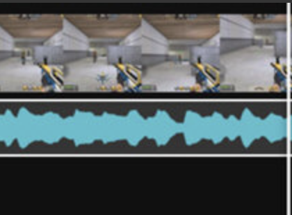
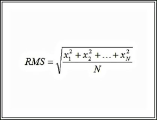
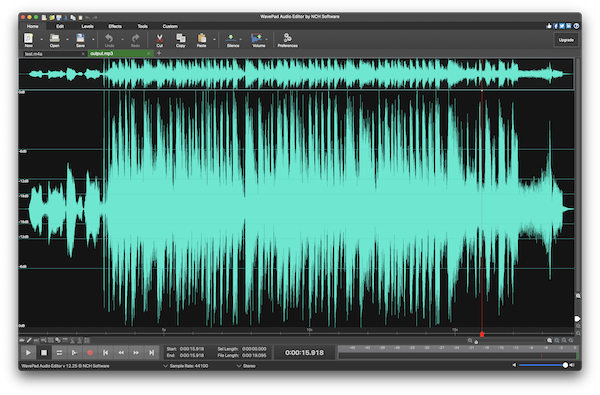

# 背景

|期待效果|初步效果|
|:---:|:---:|
|||

首先这样的波形图，是根据音频在采样点的采样值来绘制的。像 mp3 m4a 的音乐格式，都会经历音频采样、编码的过程。采样的结果是 PCM，对 PCM 利用不同的编码算法进行编码就产生了不同格式的音乐文件。

所以要得到绘制波形图的数据，**第一步**需要将压缩编码过的 PCM 音乐，解码为 PCM。这一步在 Android 上可以使用 MediaCodec 实现。获取到了 PCM 数据之后，如果你直接利用采样数据开始绘制，你应该会发现，数据量太大了，会直接导致你的绘制出现问题。

> 比如一段 PCM 音频数据，44.1 kHz 的采样率就会在每秒生成 44100 个采样点，如果我们要绘制这段音频的音量波形图，1秒就要绘制 44100 个点(单声道的情况下)，如果音频时间为10秒，则有 441000 个点。当代显示器的分辨率常见的就是 4K、2K，4K 分辨率下屏幕在水平方向最多能展示 4k 个像素点，如果不对上百万的采样点进行二次采样减小数据的量级，那么绘制出来的波形图，要么非常长，要么不长却会很难画清晰。

所以**第二步**就是对 PCM 数据进行二次采样。

# 获取 PCM 数据

## 解码音乐

Android 上利用 MediaCodec 解码音乐还是比较方便的:

```kotlin
class AudioWaveformGenerator(
    private val path: String,
    private val expectPoints: Int
) : MediaCodec.Callback() {
    private lateinit var decoder: MediaCodec
    private lateinit var extractor: MediaExtractor

    private var onFinish: () -> Unit = {}

    @Throws(Exception::class)
    fun startDecode(onFinish: () -> Unit) {
        sampleData.clear()
        this.onFinish = onFinish
        try {
            val format = getFormat(path) ?: error("Not found audio")
            val mime = format.getString(MediaFormat.KEY_MIME) ?: error("Not found mime")
            decoder = MediaCodec.createDecoderByType(mime)
            decoder.configure(format, null, null, 0)
            decoder.setCallback(this)
            decoder.start()
        } catch (e: java.lang.Exception) {
            Log.e(TAG, "start decode", e)
            throw e
        }
    }

    private fun getFormat(path: String): MediaFormat? {
        extractor = MediaExtractor()
        extractor.setDataSource(path)
        val trackCount = extractor.trackCount
        repeat(trackCount) {
            val format = extractor.getTrackFormat(it)
            val mime = format.getString(MediaFormat.KEY_MIME) ?: ""
            if (mime.contains("audio")) {
                durationS = format.getLong(MediaFormat.KEY_DURATION) / 1000000
                extractor.selectTrack(it)
                return format
            }
        }
        return null
    }

    private var inputEof = false
    private var sampleRate = 0
    private var channels = 1
    private var pcmEncodingBit = 16
    private var totalSamples = 0L
    private var durationS = 0L
    private var perSamplePoints = 0L

    override fun onOutputBufferAvailable(
        codec: MediaCodec,
        index: Int,
        info: MediaCodec.BufferInfo
    ) {
    }

    override fun onInputBufferAvailable(codec: MediaCodec, index: Int) {
        if (inputEof) return
        codec.getInputBuffer(index)?.let { buf ->
            val size = extractor.readSampleData(buf, 0)
            if (size > 0) {
                codec.queueInputBuffer(index, 0, size, extractor.sampleTime, 0)
                extractor.advance()
            } else {
                codec.queueInputBuffer(index, 0, 0, 0, MediaCodec.BUFFER_FLAG_END_OF_STREAM)
                inputEof = true
            }
        }
    }

    override fun onOutputFormatChanged(codec: MediaCodec, format: MediaFormat) {
        sampleRate = format.getInteger(MediaFormat.KEY_SAMPLE_RATE)
        channels = format.getInteger(MediaFormat.KEY_CHANNEL_COUNT)
        pcmEncodingBit = if (Build.VERSION.SDK_INT >= Build.VERSION_CODES.N) {
            if (format.containsKey(MediaFormat.KEY_PCM_ENCODING)) {
                when (format.getInteger(MediaFormat.KEY_PCM_ENCODING)) {
                    AudioFormat.ENCODING_PCM_16BIT -> 16
                    AudioFormat.ENCODING_PCM_8BIT -> 8
                    AudioFormat.ENCODING_PCM_FLOAT -> 32
                    else -> 16
                }
            } else {
                16
            }
        } else {
            16
        }
        totalSamples = sampleRate.toLong() * durationS
        perSamplePoints = totalSamples / expectPoints
    }

    override fun onError(codec: MediaCodec, e: MediaCodec.CodecException) {
        Log.e(TAG, "onError", e)
    }

}

fun MediaCodec.BufferInfo.isEof() = flags and MediaCodec.BUFFER_FLAG_END_OF_STREAM != 0
fun MediaCodec.BufferInfo.isConfig() = flags and MediaCodec.BUFFER_FLAG_CODEC_CONFIG != 0
```

## 读取 PCM 采样数据

需要注意 PCM 的数据部分的字节储存方式是**小端序**，如果采样位数大于了 8 位，就需要在读取时注意按照小端序方式读取。
接着为了方便后续处理，在读取到了采样值后，首先将每个采样点的采样值转化到 [-1, 1] 的 float 区间内：
1. 如果是 8 bit 采样大小的数据：读取为 byte(注意：Java 上由于没有无符号类型，所以在 Java 上最好读取为 int)，然后除以 128(2^8/2)，转化到 [-1, 1] 区间内
2. 如果是大于或等于 16 bit 采样大小的数据：
 - 16 bit：采样值范围为 -32678 ~ 32678，读取为 float，然后除以 32678(2^16/2)，转化到 [-1, 1] 区间内
 - 24 bit: 采样值范围为 -8388608 ~ 8388608，读取为 double，然后除以 8388608(2^24/2)，转化到  [-1, 1] 区间内
 - 32 bit 和 64 bit 进行和上面类似的转化

> 为什么要转化到 [-1, 1] 的区间内呢，这涉及到后面的重采样

```kotlin
private fun handle8bit(size: Int, buf: ByteBuffer) {
    repeat(size / if (channels == 2) 2 else 1) {
        // 左声道
        // 8 位采样的范围是: -128 ~ 128
        val left = buf.get().toInt() / 128f
        if (channels == 2) {
            buf.get()
        }
        calRMS(left)
    }
}

private fun handle16bit(size: Int, buf: ByteBuffer) {
    repeat(size / if (channels == 2) 4 else 2) {
        // 左声道
        val a = buf.get().toInt()
        val b = buf.get().toInt() shl 8
        // 16 位采样的范围是: -32768 ~ 32768
        val left = (a or b) / 32768f
        if (channels == 2) {
            buf.get()
            buf.get()
        }
        calRMS(left)
    }
}

private fun handle32bit(size: Int, buf: ByteBuffer) {
    repeat(size / if (channels == 2) 8 else 4) {
        // 左声道
        val a = buf.get().toLong()
        val b = buf.get().toLong() shl 8
        val c = buf.get().toLong() shl 16
        val d = buf.get().toLong() shl 24
        // 32 位采样的范围是: -2147483648 ~ 2147483648
        val left = (a or b or c or d) / 2147483648f
        if (channels == 2) {
            buf.get()
            buf.get()
            buf.get()
            buf.get()
        }
        calRMS(left)
    }
}
```

然后在 MediaCodec 的输出回调中根据采样大小调用上面的方法：

```kotlin
override fun onOutputBufferAvailable(
    codec: MediaCodec,
    index: Int,
    info: MediaCodec.BufferInfo
) {
    if (info.size > 0) {
        codec.getOutputBuffer(index)?.let { buf ->
            val size = info.size
            buf.position(info.offset)

            when (pcmEncodingBit) {
                8 -> {
                    handle8bit(size, buf)
                }
                16 -> {
                    handle16bit(size, buf)
                }
                32 -> {
                    handle32bit(size, buf)
                }
            }

            codec.releaseOutputBuffer(index, false)
        }
    }
```

## 利用 Python 验证解码

可以在解码完成之后，将解码之后的数据存储为 Wav 格式，然后利用如下脚本绘制波形图，测试解码是否正常。


```python
import matplotlib.pyplot as pl
import numpy as np
import wave

def read_wav():
    f = wave.open("test.wav", 'rb')
    params = f.getparams()
    nchannels, sampwidth, framerate, nframes = params[:4]
    print("channels: {} samplewidth:{} framerate:{} frames:{}".format(nchannels, sampwidth, framerate, nframes))
    str_data = f.readframes(nframes)
    f.close()
    wave_data = np.frombuffer(str_data, dtype=np.short)
    if nchannels == 2:
        wave_data.shape = -1, 2 # 将一维数组拆为二维数组: [1,2,3,4] -> [[1,2], [3,4]]
        wave_data = wave_data.T # 转置数组 [[1,2], [3,4]] -> [[1,3], [2,4]]
        time = np.arange(0, nframes) * (1.0 / framerate)
        pl.subplot(211)
        pl.plot(time, wave_data[0])  # 左声道
        pl.subplot(212)
        pl.plot(time, wave_data[1], c="g") # 右声道
        pl.xlabel("time (seconds)")
        pl.show()
    elif nchannels == 1:
        wave_data.shape = -1, 1
        wave_data = wave_data.T
        time = np.arange(0, nframes) * (1.0 / framerate)
        pl.subplot(211)
        pl.plot(time, wave_data[0])
        pl.xlabel("time (seconds)")
        pl.show()

if __name__ == "__main__":
    read_wav()
```

# 重采样

在读取到了采样值之后，需要对数据集进行重采样，减少数据集的量级，便于在屏幕上绘制。重采样的方法实现在 `calRMS` 中。
具体的计算方法为：
1. 设数据量总大小为 `T`
2. 确定你要绘制多少点 `P`
3. 计算每个绘制点将使用多少数据量进行重采样 `S`, `S=T/P`
4. 为了让重采样之后的数据集在展现时能最好的表现平均水平，所以为每一个绘制点采用 RMS 算法计算采样值

## RMS 算法

> 平方平均数

|计算方法|结果|
|:---:|:---:|
|||

每一个绘制点的数值范围为 [-RMS, RMS]。如下就是我实现的 RMS，我这是一个动态计算 RMS 的方法。

> 啥叫动态呢？就是计算的过程在解码的过程中进行，因为如果我们等解码完成之后再进行 RMS，容易因为数据量过大造成 Android 应用发生 OOM，因为一个 2 分钟的常见的音乐(44.1 KHz，16 bit 采样)，解码完成会产生 10584000 个字节的数据，如果用一个数组来存储，数组将会占用 10 MB 内存。如果一个更大长的音乐，那么内存占用将会更多。所以我只存储每次计算 RMS 之后的结果。

```kotlin
private fun calRMS(left: Float) {
    if (sampleCount == perSamplePoints) {
        val rms = sqrt(sampleSum / perSamplePoints)
        sampleData.add(rms.toFloat())
        sampleCount = 0
        sampleSum = 0.0
    }

    sampleCount++
    sampleSum += left.toDouble().pow(2.0)
}
```

> 前面提到了为啥要转化到 [-1, 1] 的区间，其实是为了让 RMS 的结果能在这个区间

# 最终效果

|最终效果|专业软件|
|:---:|:---:|
|||

可以看到，和专业的音乐编辑软件的显示差不多。

# 参考

- https://planetcalc.com/8627/
- https://www.egeniq.com/blog/alternative-android-visualizer
- https://developer.android.com/guide/topics/media/media-formats